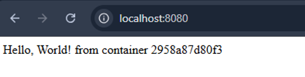
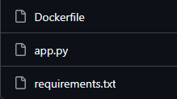
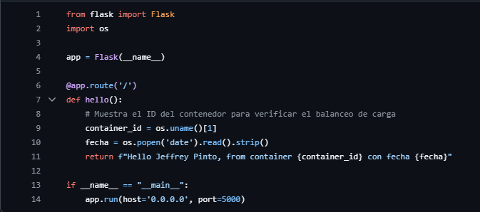

# Caso Practico 2: Modificacion y Reconstruccion de una Imagen Docker

Obtencion del codigo fuente desde una imagen existente en DockerHub, modificacion de una aplicacion Flask y construccion de una nueva imagen Docker.

---

## Estructura de la Solucion

- Imagen original:
  - `fercdevv/scale-flask:latest`

- Aplicacion:
  - Framework: Flask
  - Puerto: `5000`
  - Directorio de trabajo: `/app`
  - Archivo principal: `app.py`
  - Dependencias: `requirements.txt`

- Codigo fuente:
  - Extraido desde la imagen original
  - Modificado para mostrar apellidos, nombres y fecha solicitada

- Nueva imagen:
  - Construida mediante `Dockerfile`
  - Publicada en DockerHub

- Repositorio:
  - Codigo fuente modificado publicado en GitHub

---

## Obtencion del Codigo Fuente

1. Descargar la imagen original:

   ```bash
   docker pull fercdevv/scale-flask:latest
   ```

2. Crear un contenedor temporal:

   ```bash
   docker create --name flask-original fercdevv/scale-flask:latest
   ```

3. Extraer el contenido de `/app`:

   ```bash
   docker cp flask-original:/app ./flask-src
   ```

4. Eliminar el contenedor temporal:

   ```bash
   docker rm flask-original
   ```

---

## Modificacion

Se modifica el archivo:

```text
flask-src/app.py
```

El mensaje original de la aplicacion es reemplazado por el mensaje solicitado con los apellidos, nombres y fecha correspondiente.

---

## Construccion de la Nueva Imagen

1. Construir la imagen:

   ```bash
   docker build -t examen2caso2 ./flask-src
   ```

2. Verificar la imagen creada:

   ```bash
   docker images
   ```

3. Ejecutar el contenedor:

   ```bash
   docker run -d --name examen2caso2 -p 5000:5000 examen2caso2
   ```

4. Acceder a la aplicacion:

   ```text
   http://localhost:5000
   ```

---

## Publicacion en DockerHub

1. Iniciar sesion:

   ```bash
   docker login
   ```

2. Etiquetar la imagen:

   ```bash
   docker tag examen2caso2 <usuario-dockerhub>/examen2caso2:latest
   ```

3. Subir la imagen:

   ```bash
   docker push <usuario-dockerhub>/examen2caso2:latest
   ```

---

## Repositorios

- GitHub:

  ```text
  https://github.com/Jeffrey-7101/examen2caso2
  ```

- DockerHub:

  ```text
  AGREGAR_URL_DE_LA_IMAGEN
  ```

---

## Marcadores para Evidencias

> EVIDENCIA 01: IMAGEN ORIGINAL DESCARGADA
> 

> EVIDENCIA 02: CODIGO FUENTE EXTRAIDO
> 

> EVIDENCIA 03: MODIFICACION DEL ARCHIVO APP.PY
> 

> EVIDENCIA 04: RESULTADO DE LA APLICACION
> 
